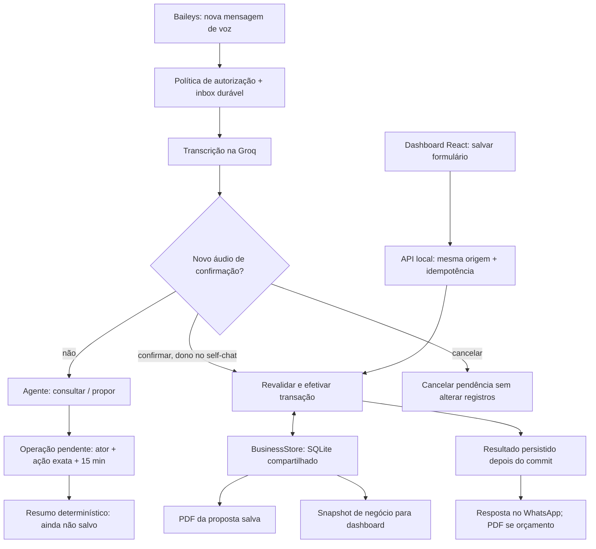

# SofIA — CloudSix: gestão local, dashboard e voz confirmada

> **Estado atual:** aplicação TypeScript em Node 24, com a própria conta WhatsApp vinculada por Baileys, inferência exclusivamente pela Groq e dashboard React/Vite local. Clientes, serviços, visitas, orçamentos/PDF, catálogo, estoque e caixa compartilham persistência real no SQLite. O modelo consulta e propõe; gravação por voz exige confirmação determinística em um novo áudio do proprietário. O [documento oficial — aba SofIA](https://docs.google.com/document/d/1bdl3aO33JhW88fJatrre9h1xCd7R32TM6FBTO6l92k0/edit?tab=t.jo3qj0l5spdi) continua sendo a fonte do escopo de produto.
>
> **Como ler:** as seções 1–7 descrevem a implementação e seus limites. A seção 8 separa a cobertura das sete funcionalidades do que ainda falta. As 12 referências avaliadas não se tornam dependências por estarem listadas. Funcionalidade implementada, verificação local, chamada isolada à Groq e entrega real no WhatsApp são evidências diferentes; não se presume homologação em produção.

## 1. Componentes atuais e fronteira da instalação

A instalação tem **uma conta, um bot e um espaço de trabalho por `DATABASE_PATH`**, não múltiplas organizações ou operadores com permissões separadas. Um processo pode operar bot + painel ou somente painel. O transporte da própria conta é Baileys via WebSocket: não precisa de Chromium/Selenium, webhook, HTTPS público, aplicativo Meta, número empresarial ou token WhatsApp Business.

| Camada | Implementação atual | Limite |
| --- | --- | --- |
| Runtime/backend | Node.js **24+**, ESM, TypeScript com remoção nativa de tipos e `node:sqlite` | Sem compilação do backend; `tsc --noEmit` verifica tipos. |
| Canal | `@whiskeysockets/baileys` **7.0.0-rc14**, fixado no manifesto/lockfile | Release candidate, não oficial nem afiliado ao WhatsApp/Meta. |
| Agente | `@openai/agents` e cliente npm `openai`, apontados exclusivamente para Groq | Bibliotecas open source de orquestração/cliente, não contratação da API OpenAI. Ferramentas de domínio somente no chat consigo mesmo. |
| Inferência | Groq Chat Completions; `qwen/qwen3.6-27b` em preview, `reasoning_effort=none` | Sem Responses, tracing, roteador ou fallback OpenAI. |
| Transcrição | Groq `whisper-large-v3-turbo`, `language=pt` | Voz gravada em português, não sessão Realtime ou ligação ao vivo. |
| Domínio | `src/business-contract.ts`, `src/business-store.ts` e `src/business-tools.ts` | Regras compartilhadas entre voz e API; modelo sem SQL, shell ou confirmação autônoma. |
| Persistência | SQLite nativo, mesmo arquivo da sessão existente | Migração aditiva; não é criptografia em repouso nem sincronização entre instalações. |
| Interface web | React/Vite, Recharts e Lucide, compilados em `web/dist/` | Servida pelo backend em `127.0.0.1`, padrão porta 3000; sem login/hosting público. |
| API local | `src/dashboard.ts`, servidor HTTP nativo do Node | Somente dados de negócio; gravações JSON da mesma origem e idempotentes. |
| PDF de orçamento | `src/quote-pdf.ts`, PDFKit local | Renderiza proposta já salva e seus snapshots; não usa IA para inventar valores. |
| PDF de entrada | `src/pdf.ts`, `pdfjs-dist` e `@napi-rs/canvas` | Todas as páginas renderizadas localmente para visão na Groq; não upload do PDF bruto. |
| Datas | `TIME_ZONE`, padrão `America/Sao_Paulo`, e Temporal | Agenda interna; sem Google/Microsoft Calendar ou mensagens agendadas. |

**Não existe caminho Cloud API em paralelo.** Regras de janela/templates da API empresarial da Meta não constituem este fluxo Baileys; isso não dispensa os termos do WhatsApp ou torna a automação oficialmente autorizada. Next.js, Auth0, PostgreSQL e S3 não são componentes atuais nem necessários para cadastrar clientes, agendar visitas ou usar o painel.

Toda requisição de IA usa a base fixa **`https://api.groq.com/openai/v1`** e a chave **`GROQ_KEY`**. O cliente não encaminha cabeçalhos herdados de configuração OpenAI. Não há chamadas, traces, consumo de créditos ou fallback para a API OpenAI; `openai` no nome do pacote/URL indica compatibilidade de cliente/API.

## 2. Fluxos compartilhados entre WhatsApp e dashboard

1. **Conectar e preservar:** restaurar credenciais Baileys e chaves Signal. O modo pareamento apresenta QR, salva a sessão e termina; não inicia o painel nem chama IA.
2. **Filtrar:** aceitar somente novas mensagens de áudio elegíveis (`messages.upsert` do tipo `notify`) em chat autorizado. Histórico `append`, texto solto, grupos, status e newsletters não entram no agente.
3. **Persistir o pedido:** inbox e deduplicação por conta/conversa/ID da mensagem. O comando aceito é durável; não há cópia indiscriminada do WhatsApp.
4. **Preparar a entrada:** baixar o áudio e eventual imagem/PDF citado, com limites de formato/tamanho/tempo. A referência é dado não confiável, não fonte de autorização.
5. **Transcrever e decidir:** após a transcrição, o código identifica confirmações/cancelamentos independentes do modelo. Outros pedidos seguem ao agente, com histórico textual recente e referências autorizadas.
6. **Consultar ou propor:** no self-chat do proprietário, `consultar_negocio` lê registros e `propor_operacao` prepara uma única ação validada. A proposta encerra a rodada com resumo determinístico de pendência, não uma declaração inventada de sucesso.
7. **Efetivar:** um novo áudio válido de confirmação chama o domínio, que revalida os dados atuais e grava a operação e seu resultado na transação. O dashboard usa a mesma validação, mas o clique de salvar já é a confirmação explícita.
8. **Entregar:** após commit, retornar o resultado. Orçamento confirmado por voz gera PDF da proposta salva para a mesma conversa; download web usa o mesmo renderizador. Falha de geração/entrega não deve levar a cadastrar o orçamento novamente.

O contexto do modelo não substitui o banco. Respostas comuns em texto e documentos enviados pelo bot não ativam outro ciclo de áudio. Não há ferramenta para o modelo escolher destinatário, enviar campanhas, confirmar a própria proposta ou alterar o arquivo de sessão.

## 3. Autorização e confirmação de operações

### Self-chat: gestão do proprietário

A política reconhece os identificadores principal/alternativo do Baileys (`remoteJid`/`remoteJidAlt`, `user.id`/`user.lid`) e normaliza componentes de dispositivo sem misturar domínios. A camada de gestão exige o comando da **própria conta, na própria conversa, enviado por ela**; não confia em uma alegação no áudio, anexo ou prompt.

O modelo recebe apenas duas ferramentas de domínio: **consulta** e **proposta**. IDs e versões vêm dos registros reais; campos ausentes ou nomes ambíguos precisam ser esclarecidos. O schema de ações suporta salvar cliente, serviço, visita, orçamento, material e caixa, além de registrar movimentação de estoque. Não expõe SQL genérico, exclusão arbitrária ou ferramenta de confirmação.

### Propor não é salvar

- **Uma pendência ativa por vez**, vinculada ao ator, ID do áudio de origem e à ação exata. Uma nova proposta não deve substituir silenciosamente a anterior: confirme ou cancele primeiro.
- Validade de **15 minutos**; proposta, expiração, cancelamento e confirmação são estados persistentes. Reiniciar não transforma uma pendência em gravação nem estende sua validade.
- Caminho recomendado: envie **um novo áudio dizendo apenas “confirmar”** ou **“cancelar”**, sem citar imagem/PDF. O próprio áudio da proposta não pode confirmá-la.
- A decisão usa uma lista fechada de frases completas após transcrição, não interpretação livre do LLM. O código também aceita `confirmo`/`pode confirmar` e `cancelo`/`pode cancelar`, ignorando caixa/espaços externos e um ponto/exclamação final. Negação, pergunta, citação, texto adicional ou um “sim” solto não são confirmações.
- A validação ocorre novamente no commit: versões, vínculos, saldo e sobreposição de agenda podem ter mudado depois do resumo. Conflito não é sucesso nem atualiza a proposta silenciosamente: a pendência exata permanece até cancelamento ou expiração. Cancele e proponha novamente os dados corrigidos antes de confirmar.
- A ação/resultados são idempotentes. Reentrega da mesma operação não autoriza uma segunda gravação nem reaproveitar a chave com parâmetros diferentes.

Conteúdo de imagem/PDF, texto extraído, nomes de arquivo, notas e histórico é **entrada não confiável**, mesmo se contiver “confirme”, “salve” ou alegar ser instrução do sistema. Os lotes intermediários de análise de PDF não possuem ferramentas de gestão.

### Outros chats: conversa, nunca ERP/CRM

`WHATSAPP_ALLOWED_JIDS` vazio limita o bot ao self-chat. A lista opcional aceita JIDs privados separados por vírgula. Em outro chat autorizado, só áudios **recebidos** (`fromMe=false`) são processados; mensagens do proprietário para outro contato são ignoradas.

A allowlist habilita **apenas conversa e análise de referências**, sem consulta a clientes, agenda, estoque, orçamentos ou caixa e sem propor/confirmar alterações. A resposta permanece no chat do pedido. `123@lid` e `123@s.whatsapp.net` não são a mesma identidade por coincidirem numericamente; vínculos vêm do protocolo, não de adivinhação.

Ao habilitar terceiros, avise que todos os áudios novos elegíveis e suas referências citadas serão tratados pela Groq. A configuração de uma allowlist não substitui tratamento adequado de dados pessoais. Grupos, status, newsletters e mídias de visualização única continuam excluídos.

## 4. SQLite: migração, domínio e falhas

### Mesmo arquivo, responsabilidades distintas

`openStore` mantém a validação da autenticação existente e cria o `BusinessStore` sobre a **mesma instância nativa `DatabaseSync`**. A migração de gestão é aditiva; não redefine a sessão, não apaga as tabelas anteriores e não exige novo QR. Base nova começa vazia, sem clientes/movimentações fictícios.

| Estado local | Finalidade / exposição |
| --- | --- |
| Credenciais Baileys e chaves Signal | Restaurar o dispositivo e persistir atualizações de chave; nunca expostas à API/dashboard. |
| Inbox e estado do processamento | Deduplicar e acompanhar pendente/em processamento/concluído/falho; não expostos no painel de negócio. |
| Contexto por conta/conversa | Últimas **10 rodadas textuais concluídas**, até 20 itens de pedido/resposta; não é todo o histórico WhatsApp. |
| Clientes e serviços | Contatos, notas, vínculos e etapas do Kanban. |
| Visitas | Intervalos e status no calendário interno, associados a cliente/serviço. |
| Orçamentos e itens | Número, fotografia do cliente/itens, totais, desconto, validade, notas e status. |
| Materiais e movimentações | Catálogo, unidade, custo, mínimo e livro de entradas/saídas/ajustes. |
| Caixa | Receita/despesa com valor, data, categoria, estado e vínculos. |
| Pendências e resultados de negócio | Ator, ação, expiração, estado e resultado idempotente; não são tabelas expostas como histórico de conversa. |

### Invariantes do domínio

- **Referências:** cliente/serviço/material precisam existir e atender às regras de atividade/vínculo. Ao informar cliente e serviço em visita, orçamento ou caixa, o cliente deve corresponder ao serviço. Edições usam versão para impedir sobrescrita silenciosa de estado desatualizado.
- **Dinheiro:** centavos inteiros seguros. Quantidades: milésimos inteiros da unidade (`quantityMilli`). Multiplicação e soma usam precisão inteira; total do item é arredondado de meio para cima para centavos. Entradas fora dos limites são recusadas, não truncadas silenciosamente.
- **Estoque:** saldo calculado a partir dos deltas no livro; não negativo. Entrada/saída têm quantidade positiva. Ajuste informa **saldo final físico desejado**, inclusive zero, e grava a diferença. Não há conversão automática entre unidades incompatíveis nem apagamento da movimentação para simular saldo.
- **Caixa:** `paid` (realizado), `pending` (pendente) e `void` (anulado) são distintos. Saldo inicial inclui realizados anteriores ao mês; entradas/saídas e série diária incluem os realizados do mês. Contas pendentes a receber/pagar consideram pendências globais. Anulados não entram como movimento efetivo.
- **Separação financeira:** entrada/compra de material não é despesa paga; orçamento emitido/aprovado não é receita recebida. Não há lançamentos financeiros ou baixas de estoque implícitos nessas operações.
- **Orçamentos:** cliente e itens são snapshots persistidos. Alterar depois o cliente ou catálogo não reescreve os dados usados no PDF do orçamento salvo; editar explicitamente o orçamento atualiza sua fotografia do cliente. Status de proposta não determina pagamento.
- **Agenda:** `startLocal`/`endLocal` entram no fuso declarado e viram instantes persistidos. Datas/horários inválidos, inexistentes ou ambíguos no fuso são recusados. Fim deve ser posterior ao início; visitas agendadas não se sobrepõem, mas intervalos contíguos são permitidos. Visita cancelada/realizada não é ocupação futura agendada.

O mês selecionado filtra visitas que intersectam o período, movimentações pela data do evento e caixa pela data do lançamento. Clientes, serviços, orçamentos, catálogo e saldo atual de estoque são gerais; indicadores de propostas/etapas não viram valores exclusivamente mensais por trocar o mês do painel.

### Commit local não é entrega externa

Pendências ainda não iniciadas sobrevivem ao reinício. Processamento interrompido ou envio incerto é tratado de forma conservadora, **sem repetir automaticamente inferência ou reenviar cegamente a resposta**. A idempotência protege a transação local; não promete entrega exatamente uma vez no WhatsApp quando a conexão cai depois de o servidor possivelmente receber a mensagem.

Se uma gravação foi confirmada, mas a resposta/PDF falhou, **confira o registro no dashboard antes de pedir a operação novamente**. Um novo áudio de cadastro pode representar uma nova intenção: não use repetição cega como recuperação. Se somente a geração do PDF falhar, o orçamento salvo continua disponível para download no painel.

Reconexão do socket tem tentativas limitadas, espera exponencial de 1 a 30 segundos e até seis tentativas. Logout, sessão inválida/substituída, incompatibilidade ou bloqueio encerram a conexão em vez de insistir indefinidamente. Encerrar não chama logout nem apaga a base para fabricar uma sessão nova.

### Proteção e operação da base

- Diretório privado (`0700`) e SQLite privado (`0600`). Diretório existente sem privacidade suficiente é recusado, não tem permissões alteradas às escondidas.
- `.env`, `data/`, arquivos SQLite/auxiliares e `web/dist/` são ignorados pelo Git. Um `DATABASE_PATH` alternativo também deve permanecer privado e fora do versionamento.
- **Não há criptografia em repouso automática.** Proteja máquina, navegador, chave Groq e backups, incluindo arquivos auxiliares SQLite. Não envie a base como diagnóstico: ela contém a sessão e os dados dos clientes.
- Dez rodadas é limite do contexto enviado ao modelo, não política automática de exclusão do histórico antigo. Anexos analisados não formam biblioteca permanente; retenção e descarte exigem cuidado também nos backups.
- Um único processo por conta/base: não rode `pair`, `dashboard` e `start` simultaneamente. Para revogar a sessão, remova o dispositivo no celular; `Ctrl+C` apenas encerra a aplicação.

## 5. Web local, PDFs e referências multimodais

### API e navegador

`src/dashboard.ts` serve os arquivos de `web/dist/` e a API no mesmo processo, com bind em **`127.0.0.1`**. O servidor exige `Host` local correspondente à porta real e gravação com `Origin` exatamente igual à origem desse host. Não há CORS aberto nem autenticação pública. A proteção de origem reduz requisições indevidas de outros sites; **não substitui login nem torna seguro publicar a porta**.

| Rota | Contrato |
| --- | --- |
| `GET /api/state?month=YYYY-MM` | Snapshot tipado de negócio e indicadores; mês omitido usa o mês atual no fuso configurado. |
| `POST /api/actions` | Ação de domínio validada, JSON UTF-8, `Origin` da mesma origem e UUID em `x-idempotency-key`; salva após confirmação explícita do formulário. |
| `GET /api/quotes/:id/pdf` | Download do orçamento persistido, com nome de arquivo sanitizado. |

Corpos de escrita têm limite de 256 KiB. O backend não disponibiliza SQL, listagem do banco, `.env`, credenciais, chaves Signal, QR, inbox ou histórico completo WhatsApp. O telefone da conta vinculada não faz parte do snapshot; telefones de clientes são campos de negócio cadastrados pelo usuário. O frontend não precisa da chave Groq e não chama diretamente os provedores.

Use a URL indicada no terminal, normalmente **http://127.0.0.1:3000**. Não exponha via túnel, proxy público ou redirecionamento de porta. A sessão do sistema operacional e o perfil local do navegador fazem parte da fronteira de confiança. Não há suporte multiempresa, RBAC ou hospedagem pública nesta instalação.

### PDF gerado a partir do orçamento

PDFKit renderiza localmente o **registro salvo**, com número, cliente, itens, unidades, quantidades, preços, subtotal, desconto, total, validade, status e notas. O documento pode ter múltiplas páginas; o cálculo vem do domínio e não da resposta textual do LLM. Download não consulta o cadastro atual para substituir silenciosamente o snapshot do orçamento.

Confirmar um orçamento por voz permite anexar esse PDF à resposta no self-chat. Isso **não é autorização para enviá-lo a um cliente**; o profissional escolhe o encaminhamento. Falha do PDF não desfaz um commit nem justifica repetir o cadastro. O PDF é gerado sob demanda, não uma biblioteca S3 ou acervo de anexos do diário.

### Entradas aceitas pelo bot

| Entrada | Ativação e tratamento |
| --- | --- |
| Áudio | Ativa diretamente no chat autorizado. OGG/Opus, MP3, MP4/M4A, WAV, WebM e FLAC; download e transcrição Groq. |
| Imagem | JPEG, PNG ou WebP **citada pelo áudio**; a voz é instrução e a imagem é referência. Sozinha, com ou sem legenda, não ativa nem altera dados. |
| PDF de entrada | Documento **citado pelo áudio**; todas as páginas renderizadas localmente e analisadas por visão. Leitura não equivale à emissão de orçamento. |
| Texto | Sozinho não ativa. Citado por voz, não vira anexo: a continuidade usa contexto recente, permitindo responder por áudio ao texto do bot. |
| Vídeo e outros documentos | Não suportados no conector atual; diário de vídeos permanece futuro. |
| Visualização única | Não abrir ou contornar o wrapper. Áudio protegido recebe aviso; conteúdo/referências protegidos não são baixados para IA. |

Cada anexo tem limite de **20 MiB e 60 segundos de download**, conferido durante a leitura. Referência a outro áudio/vídeo, formato não suportado ou mídia indisponível gera orientação de erro, não interpretação inventada. Não há FFmpeg nem conversão silenciosa de AAC/AMR.

A API Groq usada aqui não recebe PDF nativo. `pdfjs-dist` e `@napi-rs/canvas`, instalados pelo npm, renderizam **todas as páginas localmente** em sequência, como JPEG sobre fundo branco, lado maior de até 2.000 pixels. Texto extraível acompanha a referência quando disponível, mas não substitui imagens. O PDF bruto não é enviado como arquivo; seu conteúdo visual/textual segue para a Groq.

Cada chamada de visão recebe **até 3 páginas/imagens**. O [guia de visão](https://console.groq.com/docs/vision) menciona 5, mas o [cartão Qwen3.6-27B](https://console.groq.com/docs/model/qwen/qwen3.6-27b) informa **MAX INPUT IMAGES 3**; prevalece o limite conservador. Documentos maiores são analisados em lotes e sintetizados a partir de todos os lotes. Não há corte silencioso de páginas finais nem reenvio das imagens como histórico textual.

PDF inválido, protegido por senha ou impossível de renderizar gera erro de entrada. Falhas do provedor são sanitizadas por etapa. Processar todas as páginas não garante transcrição integral, visão perfeita ou leitura de detalhes pequenos; PDFs maiores consomem mais chamadas, tempo e cota.

### IA: limites e privacidade

- Modelos explícitos em `GROQ_MODEL` e `GROQ_TRANSCRIPTION_MODEL`; padrões `qwen/qwen3.6-27b` e `whisper-large-v3-turbo`. Chave exata `GROQ_KEY`; variáveis `OPENAI_*` não são lidas. Valores de referência em [.env.example](.env.example).
- Transcrição em português (`language=pt`). Geração com até **800 tokens de saída por chamada**, timeout de **60 segundos por requisição** e **retries=0**. Não é prazo global para várias chamadas de PDF/ferramentas; limite de saída não elimina cotas de entrada, visão ou tokens por minuto.
- Chat Completions, sem sessão remota Conversations/Responses. Tracing e logs sensíveis do SDK são desativados; não há fallback de provedor ou tráfego de IA/trace para OpenAI.
- Renderização local e tracing desligado **não significam inferência local**. Áudio, referências e contexto autorizado seguem à Groq; no self-chat, dados de negócio consultados também podem compor o contexto. Credenciais do dispositivo, banco completo e código-fonte não são enviados.
- Erros não devem expor resposta bruta do provedor, prompts, anexos, chaves ou credenciais. Políticas de tratamento do provedor continuam aplicáveis.

Realtime não é necessário para voz gravada; o quickstart de sessões ao vivo avaliado não é o adaptador de anexos WhatsApp usado aqui.

## 6. Instalar, compilar e executar

1. Instale **Node.js 24+** e execute **`npm ci`** com o lockfile. Preserve o `postinstall`/`patch-package` e a versão Baileys fixada; não atualize automaticamente para `latest`.
2. **Somente se `.env` não existir**, copie `.env.example`. Instalação existente preserva `.env`, `DATABASE_PATH` e sessão. O painel e pareamento não exigem chave Groq.
3. Para **somente gestão web**, execute **`npm run dashboard`**: o hook `predashboard` executa `npm run build`, e o processo abre o painel sem criar agente ou conexão WhatsApp.
4. Para vincular uma conta ainda não pareada, execute **`npm run pair`**. O comando não compila/abre o painel nem chama IA, mostra QR no terminal e termina quando a sessão é salva.
5. Para **bot + dashboard**, configure **`GROQ_KEY`** e execute **`npm start`**. O hook `prestart` executa `npm run build`; a sessão já vinculada é reutilizada.
6. Use um modo por vez e encerre com `Ctrl+C`. Reiniciar não é logout e não apaga clientes, agenda ou propostas.

`npm run build` executa **`vite build`**, com raiz `web` e saída `web/dist/`. Esses arquivos estáticos não são versionados. O servidor Node continua executando `src/index.ts` nativamente; não há build JavaScript separado do backend. O servidor recusa iniciar o painel se os arquivos compilados estiverem ausentes, em vez de servir uma tela falsa.

| Configuração | Padrão / efeito |
| --- | --- |
| `DATABASE_PATH` | `./data/sofia.sqlite`; arquivo persistente privado, uma conta/espaço de trabalho. |
| `TIME_ZONE` | `America/Sao_Paulo`; fuso IANA validado para horários e períodos. |
| `DASHBOARD_PORT` | `3000`; bind continua somente em `127.0.0.1`. |
| `GROQ_KEY` | Obrigatória em `npm start`; dispensada em `dashboard`/`pair`. |
| `WHATSAPP_ALLOWED_JIDS` | Vazia por padrão; terceiros habilitados continuam sem acesso ERP/CRM. |

`npm start -- --help` mostra a ajuda sem exigir credenciais, embora o hook de frontend seja executado pelo npm antes dela. `npm run typecheck` verifica backend e frontend; `npm test` executa as verificações locais. A existência desses comandos não é uma alegação de resultados na máquina do leitor ou de validação real da conta WhatsApp. Exemplos de voz e operação no [README](README.md).

## 7. Custos, risco e limites de verificação

- **Groq:** disponibilidade, cotas gratuitas e preços variam por conta/modelo; não há uso gratuito ilimitado garantido. Voz normalmente requer transcrição e geração; PDFs e ferramentas podem exigir mais chamadas. Qwen3.6-27B está em preview. Bibliotecas open source `@openai/agents`/`openai` não exigem créditos OpenAI neste caminho.
- **Infraestrutura:** máquina Node, armazenamento privado e navegador local; internet é necessária para WhatsApp/Groq, não para cadastrar registros no modo web isolado após a instalação. Nenhum gateway, plano Cloud API, PostgreSQL, Next.js ou Auth0 é necessário.
- **Baileys:** protocolo de terceiro e biblioteca não oficial, com risco de incompatibilidades, restrição/banimento e desconexão da própria conta. Usar release candidate amplia a necessidade de cuidado; não há garantia contra detecção.
- **Limites intencionais:** nenhum envio em massa, mecanismo de evasão, contato não solicitado, lembrete automático ou follow-up. A agenda é interna; sem sincronização Google/Microsoft.
- **Evidência:** verificar domínio/API não prova entrega externa. Abrir o painel não prova transcrição ou pareamento. Chamada isolada Groq não prova confirmação por um novo áudio nem entrega do PDF. Não confundir smoke test com homologação em produção.

## 8. Cobertura oficial e evolução restante

As sete funcionalidades permanecem no produto; a cobertura atual é **parcial onde indicado**, não um ERP completo presumido pelo simples uso de IA.

| Funcionalidade oficial | Implementado | Restante / limite |
| --- | --- | --- |
| **5.1. Gerador inteligente de orçamentos por voz** | Proposta validada, confirmação separada, persistência cliente/itens/valores, PDF do orçamento salvo para download e anexo no self-chat. | Encaminhamento ao cliente é manual; sem follow-up ou assinatura eletrônica. |
| **5.2. Controle inteligente de estoque por voz/imagem** | Catálogo, unidades, livro de entradas/saídas/ajustes, vínculo ao serviço, saldo não negativo e confirmação; foto/PDF citado pode orientar proposta. | Sem cadastro estruturado de fornecedores/compras, acervo de comprovantes ou conciliação fiscal automática. |
| **5.3. Gestão inteligente de clientes** | Clientes vinculados a serviços, visitas, propostas e caixa; agenda local com fuso e conflitos. | Sem histórico completo de comunicação, diário multimodal, lembretes automáticos ou calendário externo. |
| **5.4. Alertas de materiais e desperdício** | Mínimo configurável e indicação de estoque baixo a partir de dados reais. | Previsão de consumo/desperdício, comparação de estimativas, aprendizado histórico e notificações proativas são futuros. |
| **5.5. Kanban de obras e serviços** | **Aguardando visita → Orçamento → Aguardando aprovação → Em execução → Concluído**, editável no painel ou por voz confirmada. | Sem encadeamento implícito de etapa, compra, orçamento e recebimento; ambiguidades precisam de esclarecimento. |
| **5.6. Diário de bordo multimodal** | Não implementado como diário. Análise pontual de imagem/PDF é apenas referência do pedido. | Organizar **fotos, vídeos, áudios e mensagens** cronologicamente por cliente/obra/data, com prestação de contas e relatórios de execução. |
| **5.7. Controle financeiro simplificado** | Receita/despesa explícita em centavos, cliente/serviço/categoria/data, realizado/pendente/anulado e fluxo de caixa por período. | Conciliação bancária, margem estimada consolidada por serviço e automações de cobrança; compra/proposta não gera pagamento automático. |

### Infraestrutura futura não é requisito atual

O monólito modular compartilha domínio entre canal e web sem criar microserviços ou segundo framework de agentes. **React/Vite e SQLite já atendem o painel local atual**; não é necessário migrar para Next.js/PostgreSQL/Auth0 para obter os recursos descritos.

[INFERENCE] Se o produto vier a suportar múltiplas organizações, operadores remotos ou integrações externas, será necessário projetar identidade, isolamento de dados, permissões, retenção e implantação apropriados. PostgreSQL pode ser avaliado por necessidades de concorrência/escala; Auth0/OIDC por login e autorização; storage privado por um diário de anexos. São decisões condicionadas a novos requisitos, não etapas obrigatórias desta instalação. Next.js é uma alternativa de framework, não um componente ausente que impeça o dashboard.

Vídeos do diário exigiriam um pipeline explícito de armazenamento/organização; leitura de frames/trilha seria outra capacidade. Integração Google/Microsoft ou lembretes só justificam credenciais OAuth, Token Vault e scheduler quando forem solicitados e implementados. Não existem hoje por se salvar uma visita no calendário local.

## 9. Avaliação dos 12 links enviados

A distinção é entre **usado agora**, **referência** e **opção futura**. Capacidades dos fornecedores vêm das fontes; recomendações de adoção são análise técnica, não integração já executada na SofIA.

| Referência | O que oferece / decisão para SofIA |
| --- | --- |
| [1. Agents Everywhere starter kit](https://github.com/CopilotKit/agents-everywhere-starter-kit) | Templates Slack, web e mobile, com BuiltInAgent no chat compartilhado. **Referência, não importar inteiro.** Não entrega a conexão da própria conta via Baileys nem os módulos ERP. |
| [2. OpenAI Agents JS quickstart](https://openai.github.io/openai-agents-js/guides/quickstart/) | Agent, run e ciclo de execução. **SDK open source adotado**, com Groq/Chat Completions e tracing desativado. Ferramentas de consulta/proposta de negócio estão implementadas; confirmação continua no código determinístico, não na escolha do modelo. Não implica usar a API OpenAI. |
| [3. OpenAI voice agents quickstart](https://openai.github.io/openai-agents-js/guides/voice-agents/quickstart/) | RealtimeAgent/RealtimeSession para voz ao vivo. **Não usado.** Áudios gravados do WhatsApp usam transcrição Groq com Whisper. |
| [4. CopilotKit quickstart](https://docs.copilotkit.ai/quickstart) | Assistente contextual em React e interação com estado/UI. **Opcional, não adotado no dashboard atual React/Vite.** Kanban/gráficos não precisam dele; não substitui Baileys. |
| [5. OpenRouter models](https://openrouter.ai/models) | Catálogo, roteamento e BYOK. **Não adicionar agora.** A SofIA usa Groq diretamente; chaves, cotas e preços de um provedor não viram saldo de outro roteador. Não há fallback OpenRouter. |
| [6. Auth0 para AI Agents](https://auth0.com/ai/docs/get-started/overview) | Identidade, acesso delegado, Token Vault e autorização. **Opção futura seletiva, não requisito do painel local.** Login web não é sessão de dispositivo WhatsApp; Token Vault só se integrações OAuth externas justificarem. |
| [7. Auth0 Agent Skills](https://auth0.com/docs/quickstart/agent-skills) | Instruções para assistentes de programação implementarem Auth0. **Ferramenta de desenvolvimento opcional**, não habilidade de gestão nem autorização runtime da SofIA. |
| [8. Evento Ambiguous / AI Tinkerers](https://www.ambiguous.ai/events/ai-tinkerers-openai) | Contexto do evento e workspace. **Referência**, não obrigação de integração, conector WhatsApp ou créditos adicionais confirmados. |
| [9. Ambiguous llms.txt](https://www.ambiguous.ai/llms.txt) | Índice de documentação REST, MCP, apps, autenticação e preços. **Referência para backoffice opcional**, não persistência necessária: a gestão atual usa SQLite local. |
| [10. Ambiguous CLI](https://www.ambiguous.ai/agents/cli) | Cliente para documentos, tarefas, CRM, arquivos, emails e APIs do SaaS. **Não executar uma CLI por mensagem.** Uma eventual integração deve preferir contratos REST/MCP apropriados. |
| [11. Mozilla hackathon search example](https://github.com/mozilla-ai/hackathon-search-example) | Exemplo Python com any-agent, llamafile e ferramentas Exa via MCP. **Referência de busca**, não base do ERP nem motivo para acrescentar outro runtime/framework. |
| [12. llamafile quickstart](https://docs.mozilla.ai/llamafile/getting-started/quickstart) | Inferência local e endpoint Chat Completions. **Experimento opcional futuro**, não o provedor atual. Não consome cota Groq para inferência local e não torna a conexão WhatsApp offline. |

### Limites das alternativas

- **CopilotKit:** starter/quickstart não são conector Baileys. O adaptador Channels/WhatsApp anteriormente avaliado usa outro transporte e não foi selecionado. Não manter segundo listener das mesmas mensagens. Compartilhar o agente com painel CopilotKit exigiria adaptação AG-UI; o quickstart BuiltInAgent não comprova isso. AG-UI conecta agente/UI; MCP conecta agente/ferramentas; Baileys é o transporte selecionado.
- **Ambiguous:** o contrato público oferece contatos, propostas/PDF, tarefas, arquivos, OCR, transcrição e automações. Enviar proposta por email e ter catálogo não comprovam estoque por obra, caixa transacional ou conector nativo WhatsApp. Não foi validada hospedagem arbitrária do backend SofIA ou compatibilidade dos agentes hospedados com esta configuração Groq. Eventual integração exige definir o dono de cada dado, evitando duplicação de cadastros/caixa; preços e licenças do SaaS são próprios.
- **OpenRouter/llamafile:** compatibilidade parcial de API não implica equivalência de sessões, multimodalidade ou comportamento. A SofIA usa Groq diretamente, sem roteador/fallback. No exemplo Mozilla, inferência é local e busca Exa é remota. Nenhuma alternativa é necessária ao sistema local atual.

## 10. Fontes técnicas

Além do documento oficial e dos 12 links:

- **Baileys — projeto da biblioteca, não do WhatsApp:** [README e não afiliação/licença](https://github.com/WhiskeySockets/Baileys/blob/7e7b0757e3f9f3c7789fb1cfd2f241d5002a199a/.github/README.md), [código da versão fixada](https://github.com/WhiskeySockets/Baileys/tree/7e7b0757e3f9f3c7789fb1cfd2f241d5002a199a/src), [npm 7.0.0-rc14](https://registry.npmjs.org/@whiskeysockets/baileys/7.0.0-rc14), [guia de uso](https://baileys.wiki/docs/intro/) e [migração v7](https://whiskey.so/migrate-latest). O projeto alerta sobre mudanças incompatíveis e não recomenda spam/envio automatizado em massa.
- **Node.js:** [TypeScript nativo](https://nodejs.org/api/typescript.html) e [SQLite](https://nodejs.org/api/sqlite.html). Este projeto exige Node 24+, independentemente do mínimo de Baileys.
- **OpenAI Agents JS e cliente `openai`:** [modelos](https://openai.github.io/openai-agents-js/guides/models/), [ferramentas](https://openai.github.io/openai-agents-js/guides/tools/), [sessões](https://openai.github.io/openai-agents-js/guides/sessions/), [aprovações](https://openai.github.io/openai-agents-js/guides/human-in-the-loop/), [guardrails](https://openai.github.io/openai-agents-js/guides/guardrails/), [tracing](https://openai.github.io/openai-agents-js/guides/tracing/) e [cliente open source](https://github.com/openai/openai-node). Referências das bibliotecas, não contratação/tráfego para API OpenAI ou alegação de implementar todos os recursos do SDK.
- **Groq — provedor atual:** [chaves](https://console.groq.com/keys), [documentação](https://console.groq.com/docs/overview), [compatibilidade OpenAI/Chat Completions](https://console.groq.com/docs/openai), [transcrição](https://console.groq.com/docs/speech-to-text), [visão](https://console.groq.com/docs/vision), [cartão Qwen3.6-27B](https://console.groq.com/docs/model/qwen/qwen3.6-27b) e [limites de taxa](https://console.groq.com/docs/rate-limits). Preview e limite conservador de 3 imagens conforme o cartão.
- **PDF local:** [PDF.js / `pdfjs-dist`](https://mozilla.github.io/pdf.js/) e [`@napi-rs/canvas`](https://github.com/Brooooooklyn/canvas) para leitura/renderização de entrada; [PDFKit](https://pdfkit.org/) para geração do orçamento salvo. Sem conversor remoto ou FFmpeg; visão de referências ocorre depois na Groq.
- **Dashboard:** [React](https://react.dev/), [Vite](https://vite.dev/guide/) e [Recharts](https://recharts.org/). O frontend atual é servido localmente pelo Node, não pelo Next.js ou por um SaaS autenticado.
- **CopilotKit:** [agente do starter](https://github.com/CopilotKit/agents-everywhere-starter-kit/blob/main/packages/agent-core/src/agent.ts) e [AG-UI](https://docs.ag-ui.com/introduction). Não são o transporte selecionado.
- **Auth0:** [Token Vault](https://auth0.com/docs/secure/call-apis-on-users-behalf/token-vault), [autorização assíncrona](https://auth0.com/ai/docs/intro/asynchronous-authorization) e [skill de desenvolvimento](https://github.com/auth0/agent-skills/blob/main/plugins/auth0/skills/auth0/SKILL.md). Não integrados ao painel local.
- **Ambiguous:** [OpenAPI público](https://app.ambiguous.ai/api/openapi.json), [CRM](https://www.ambiguous.ai/applications/crm), [autenticação](https://www.ambiguous.ai/auth.md), [preços](https://www.ambiguous.ai/pricing.md) e [CLI](https://registry.npmjs.org/ambiguous/latest). Referências de contrato, não integração executada com conta autenticada.
- **OpenRouter:** [Responses stateless](https://openrouter.ai/docs/api_reference/responses/overview) e [BYOK](https://openrouter.ai/docs/guides/overview/auth/byok). Não configurado nesta instalação.
- **Mozilla:** [código do exemplo](https://github.com/mozilla-ai/hackathon-search-example/blob/main/search_agent.py) e [dependências](https://github.com/mozilla-ai/hackathon-search-example/blob/main/pyproject.toml). Não foi executado modelo local como parte desta documentação.
