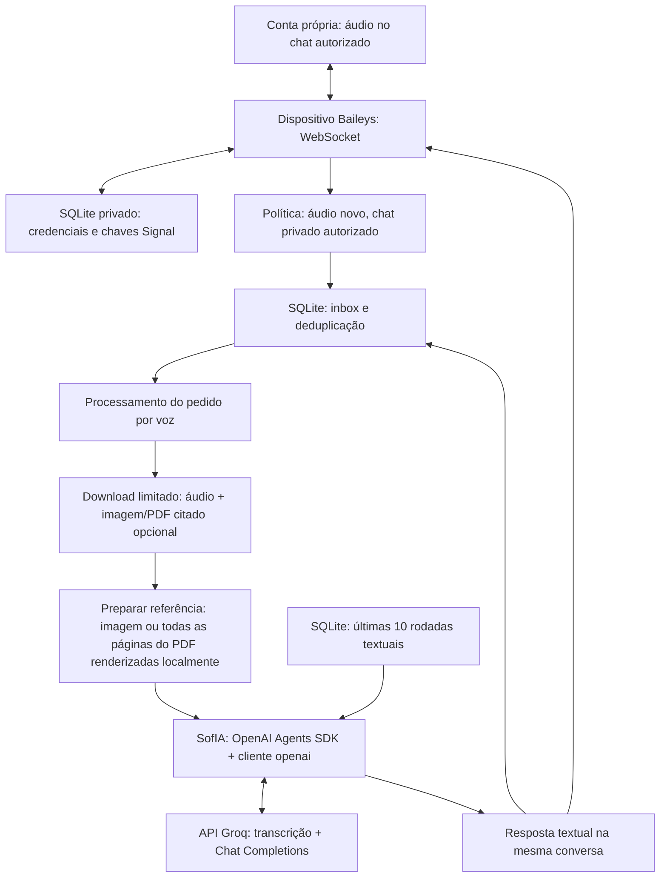

# SofIA — CloudSix: conector Baileys e evolução do produto

> **Estado atual:** MVP conversacional **por áudio** com a própria conta do WhatsApp, vinculada por Baileys, e inferência exclusivamente pela Groq. O OpenAI Agents SDK e o cliente npm `openai` são bibliotecas open source, não o provedor de IA desta instalação. Um áudio novo autorizado é o pedido; a resposta é textual. Imagem/PDF só entram como referência citada por esse áudio. O conector não implementa as sete funcionalidades de gestão nem o dashboard. O [documento oficial — aba SofIA](https://docs.google.com/document/d/1bdl3aO33JhW88fJatrre9h1xCd7R32TM6FBTO6l92k0/edit?tab=t.jo3qj0l5spdi) continua sendo a fonte do escopo de produto.
>
> **Como ler:** as seções 1–7 descrevem a implementação e a operação atuais. A seção 8 é arquitetura futura proposta ([INFERENCE]), não infraestrutura necessária para iniciar. A avaliação dos 12 links mantém referências úteis sem transformar alternativas em dependências. Verificações locais e chamadas isoladas à API não equivalem a homologar o fluxo completo de pareamento e pedidos reais pelo WhatsApp.

## 1. Decisão atual: a conta do usuário, não um número empresarial

O transporte escolhido é **Baileys**, biblioteca open source TypeScript que conversa com o protocolo de dispositivos conectados do WhatsApp por WebSocket. O usuário vincula a própria conta lendo um QR no celular. O processo Node reutiliza as credenciais salvas e mantém a conexão enquanto está em execução; não precisa de Chromium/Selenium.

**Não existe caminho Cloud API em paralelo.** A integração empresarial da Meta foi uma alternativa anteriormente avaliada e rejeitada para este MVP. Não é necessário webhook, endpoint HTTPS público, aplicativo de desenvolvedor Meta, token empresarial ou número WhatsApp Business. Regras comerciais de janela de atendimento/templates da Cloud API não constituem o fluxo implementado por Baileys; isso não dispensa os termos de uso do WhatsApp nem significa autorização oficial para automação.

| Camada atual | Implementação | Limite |
| --- | --- | --- |
| Canal | `@whiskeysockets/baileys` **7.0.0-rc14**, fixado no manifesto e lockfile | **Release candidate**, não versão estável garantida; mudanças de protocolo podem quebrar a conexão. |
| Runtime | Node.js **24+**, TypeScript, ESM e imports `.ts` | Remoção nativa de tipos pelo Node; `tsc --noEmit` verifica tipos, não é etapa de build para iniciar. |
| Agente | `@openai/agents` **0.18.0** e cliente npm `openai`, configurados para a Groq | Bibliotecas open source de orquestração/cliente; sem ferramentas de alteração de dados de negócio, chamadas ou tracing para a OpenAI. |
| Inferência | API Groq direta, via Chat Completions; `GROQ_MODEL=qwen/qwen3.6-27b` | Modelo de texto e visão em **preview**, usado em modo não pensante (`reasoning_effort=none`). Respostas textuais, não geração de documentos ou operações ERP. |
| Transcrição | API Groq; `GROQ_TRANSCRIPTION_MODEL=whisper-large-v3-turbo`, com `language=pt` fixo | Áudio gravado em português, sem depender da detecção automática de idioma. Não é sessão Realtime ou chamada de voz; não há nova variável de ambiente para o idioma. |
| Referência PDF | Renderização local com `pdfjs-dist` e `@napi-rs/canvas`, seguida de visão na Groq | Todas as páginas, em lotes de até 3 imagens; PDFs maiores passam por análise dos lotes e síntese. Não é entrada PDF nativa da API. |
| Persistência | SQLite nativo do Node, em `DATABASE_PATH` | Credenciais/chaves do dispositivo, inbox/deduplicação e contexto textual; um processo/conta/banco. |
| Pareamento | QR no terminal | Iniciado pelo usuário; `npm run pair` não requer `GROQ_KEY` nem chama IA. |

PostgreSQL, storage S3, Next.js e Auth0 **não são usados para rodar este MVP**. Não há API HTTP pública, dashboard, scheduler de lembretes ou segundo framework de agentes no caminho atual.

Toda requisição de IA usa a base fixa **`https://api.groq.com/openai/v1`**, com a chave **`GROQ_KEY`**. O nome `openai` nos pacotes e no caminho da URL indica compatibilidade de cliente/API: não há chamadas, traces, uso de créditos ou fallback para a API OpenAI. A conversa usa **Chat Completions**, nunca Responses; a transcrição usa o endpoint de áudio da Groq.

## 2. Componentes e fluxo implementado

1. **Conectar:** restaurar o estado de autenticação Baileys ou apresentar QR para o vínculo pelo celular. Persistir tanto atualizações de credenciais quanto alterações das chaves Signal; salvar somente o QR ou um token não implementaria uma sessão de dispositivo.
2. **Filtrar antes de processar:** aceitar apenas novas mensagens de áudio elegíveis (`messages.upsert` do tipo `notify`) no chat autorizado. Texto, imagem e PDF sozinhos não ativam o agente. Histórico do tipo `append`, grupos, status e newsletters também não entram.
3. **Persistir o pedido aceito:** deduplicar por identidade da conta, conversa e ID da mensagem de áudio. O SQLite guarda o pedido necessário para processamento posterior; não é uma cópia indiscriminada do WhatsApp.
4. **Preparar a entrada:** baixar o áudio do pedido e, se ele estiver respondendo a uma imagem/PDF, a referência citada. Verificar tipo e limites de tamanho/tempo. Rasterizar localmente todas as páginas do PDF; não enviar o arquivo bruto ao provedor. Não atravessar wrappers de visualização única nem substituir áudio indisponível por uma legenda ou comando escrito.
5. **Consultar a IA:** carregar o contexto textual daquela conta/conversa e transcrever o áudio na Groq. A transcrição é a instrução; a imagem citada ou as páginas renderizadas/texto do PDF acompanham a análise. PDFs com mais de 3 páginas usam análise em lotes de até 3, seguida de síntese dos resultados de todos os lotes. O agente pode perguntar dados faltantes, interpretar ou preparar um rascunho, mas não tem ferramentas que gravem registros ERP.
6. **Responder na mesma conversa:** enviar a resposta textual pelo socket Baileys e registrar o resultado. Como somente áudio ativa o processamento, a própria resposta em texto não cria um ciclo; em outros chats, também é excluída por ser mensagem enviada pela própria conta.

Só o áudio autorizado, a imagem citada ou as páginas renderizadas/texto do PDF citado, e o contexto textual desses pedidos são enviados à Groq. O PDF bruto não é enviado como arquivo, mas seu conteúdo visual e textual é compartilhado para inferência; o código-fonte do projeto não é enviado. O dispositivo pode receber outros eventos do protocolo para manter a sessão; isso não autoriza armazenar ou encaminhar todas as conversas para o agente. Não há importação do histórico pessoal para a memória da SofIA.

## 3. Fronteira de autorização

### Padrão: conversa consigo mesmo

`WHATSAPP_ALLOWED_JIDS` vazio limita o uso à conversa com a própria conta vinculada. **Envie uma mensagem de voz normalmente: o próprio áudio ativa a SofIA.** Não precisa de palavra-chave, texto prévio ou resposta citando o áudio. Por exemplo, grave “Prepare um rascunho de orçamento e pergunte os dados que faltarem”; a resposta volta em texto. Para continuar a conversa, envie outro áudio.

Todo áudio novo elegível nessa conversa é tratado como um pedido à IA enquanto o processo estiver ativo; não envie ali voz que não queira compartilhar com a Groq. Não há modo de armar mensagens seguintes. Para analisar foto/PDF, envie o arquivo, use **Responder** nele e grave a instrução: o áudio é obrigatório, a referência é opcional. Texto, foto, PDF e legenda enviados sozinhos não ativam processamento. Exemplos completos estão no [README](README.md).

### Outros chats: adesão explícita e privada

A lista opcional aceita JIDs privados separados por vírgula, por exemplo `5511999999999@s.whatsapp.net,123456789@lid`. Esses identificadores são exemplos, não contatos ativos por padrão.

- Em outro chat autorizado, só áudios **recebidos** (`fromMe=false`) são processados. Uma mensagem que o proprietário envia a outro contato não aciona a SofIA.
- A resposta permanece no chat do pedido; não existe ferramenta para o modelo escolher destinatários ou enviar mensagens em massa.
- A identificação considera o JID principal/alternativo fornecido pelo Baileys v7 (`remoteJid`/`remoteJidAlt`) e as identidades da própria conta (`user.id`/`user.lid`).
- Normalização remove componentes de dispositivo quando aplicável, mas preserva o domínio. `123@lid` e `123@s.whatsapp.net` **não são a mesma identidade** só porque a parte numérica coincide; vínculos vêm dos identificadores do protocolo, não de adivinhação.
- Grupos, status e newsletters continuam excluídos; colocar um identificador desses na configuração não amplia o escopo para conversas coletivas.
- Ao habilitar terceiros, explique que **todos os novos áudios elegíveis recebidos deles** serão tratados como pedidos à IA na Groq, com as imagens citadas ou as páginas renderizadas/texto dos PDFs que citarem. A configuração técnica de uma allowlist não substitui o tratamento adequado de dados pessoais.

## 4. SQLite, sessão e falhas

O SQLite atual tem responsabilidades distintas:

| Estado | Finalidade |
| --- | --- |
| Credenciais do dispositivo e chaves Signal | Restaurar a sessão conectada e acompanhar mudanças de chave; informação sensível que pode dar acesso à conta. |
| Inbox de pedidos por áudio aceitos e deduplicação | Evitar executar novamente a mesma mensagem e permitir retomar pedidos ainda pendentes após reinício. |
| Estado do processamento e resultado textual | Distinguir pendente, em processamento, concluído e falho; não confundir resposta gerada com entrega confirmada. |
| Contexto por conta/conversa | Recuperar as **10 últimas rodadas concluídas**, no máximo 20 itens de transcrição do pedido/resposta, para a próxima chamada. Não é memória de todo o WhatsApp nem banco de clientes/obras. |

**Política conservadora de falhas:** pendências ainda não iniciadas são duráveis. Processamento interrompido ou envio cujo resultado ficou incerto é marcado como falho; não há repetição automática de inferência ou reenvio cego da resposta. O usuário pode conferir a conversa e formular um novo pedido. Não é possível prometer entrega externa exatamente uma vez quando a conexão cai depois de o servidor possivelmente receber a mensagem.

A reconexão diz respeito **somente ao socket**: falhas transitórias têm tentativas limitadas com espera exponencial de 1 a 30 segundos, até seis tentativas. Logout, sessão inválida/substituída, incompatibilidade ou bloqueio encerram a conexão em vez de insistir indefinidamente. Encerrar a aplicação não chama logout nem apaga a base para fabricar uma sessão nova. Um banco inválido não deve ser silenciosamente substituído.

### Proteção e operação da base

- Diretório privado (`0700`) e arquivo SQLite privado (`0600`). Um diretório existente sem privacidade suficiente é recusado, não tem suas permissões alteradas às escondidas.
- `data/` e `.env` são ignorados pelo Git. Se mudar `DATABASE_PATH`, escolha outro diretório privado fora do versionamento; a configuração não torna qualquer caminho automaticamente seguro para publicar.
- **Não há criptografia em repouso automática.** Proteja a máquina, a chave Groq e os backups da base, incluindo eventuais arquivos auxiliares SQLite. Não envie a base como anexo de suporte.
- O limite de 10 rodadas refere-se ao contexto enviado ao modelo, não a uma promessa de exclusão automática de todos os registros mais antigos. Defina retenção e descarte apropriados para a conta e seus backups.
- Use um único processo por conta/base; não rode `pair` e `start` simultaneamente nem compartilhe o arquivo entre instâncias.
- Para revogar a sessão, remova o dispositivo em **WhatsApp → Dispositivos conectados**. Parar o Node com `Ctrl+C` não revoga o vínculo. Não há comando de reset/logout automático neste MVP.

## 5. Pedidos por áudio e referências multimodais

| Entrada atual | Ativação e tratamento |
| --- | --- |
| Áudio | **Ativa diretamente** no chat autorizado. Download → transcrição Groq → instrução no agente. Formatos aceitos: OGG/Opus, MP3, MP4/M4A, WAV, WebM e FLAC. |
| Imagem | JPEG, PNG ou WebP **citada pelo áudio**: o áudio é a instrução e a imagem é referência para visão. Enviar a imagem sozinha, com ou sem legenda, não ativa o agente nem altera estoque/cadastro. |
| PDF | Documento **citado pelo áudio**: a transcrição instrui o modelo; todas as páginas são rasterizadas localmente e analisadas por visão em lotes de até 3. PDF/legenda sem áudio não ativam o agente. Ler um PDF não significa gerar um orçamento PDF. |
| Texto | Sozinho não ativa o agente. Quando citado por um áudio, é ignorado como referência de mídia: a voz continua sendo processada com o histórico recente. Isso permite responder por áudio ao texto do bot sem tratar a citação como novo anexo. A saída textual não volta a acionar o processamento. |
| Vídeo e outros documentos/formatos | Não suportados pelo conector atual; o diário de vídeos permanece planejado no produto. |
| Visualização única | Não abrir nem contornar o wrapper de privacidade. Áudio protegido recebe um aviso de formato não suportado; mensagens protegidas sem áudio são ignoradas. Conteúdo e referências protegidos não são baixados para a IA. |

O download é limitado a **20 MiB e 60 segundos por anexo**, de forma independente para o áudio e sua referência, com conferência durante a leitura. Só imagem/PDF são referências de mídia aceitas; texto citado é ignorado como anexo, enquanto citar outro áudio ou vídeo gera um aviso de referência não suportada. Áudio ou referência indisponíveis também geram orientação de erro, não uma interpretação inventada. Não há conversor FFmpeg nem nova dependência de sistema instalada pelo projeto; AAC/AMR não são convertidos silenciosamente. OGG é um formato documentado pela Groq para transcrição; aceitar o tipo não garante a validade do arquivo nem a qualidade do reconhecimento.

### PDF: todas as páginas, renderização local e visão

A API Groq usada pelo conector não recebe PDF nativo. `pdfjs-dist` e `@napi-rs/canvas`, instalados pelo npm, rasterizam **todas as páginas localmente**, em sequência, como JPEG sobre fundo branco, com lado maior de até 2.000 pixels. O texto extraível também acompanha a referência, quando disponível; ele **não substitui as imagens das páginas**. Assim, páginas digitalizadas e elementos visuais continuam sendo enviados para visão, em vez de se perderem numa conversão somente para texto. A renderização não garante leitura perfeita de detalhes pequenos ou digitalizações ruins.

Cada chamada de visão recebe **no máximo 3 páginas/imagens**. Há uma divergência nas fontes Groq: o [guia de visão](https://console.groq.com/docs/vision) menciona 5 imagens por requisição para Qwen3.6, enquanto o [cartão oficial de `qwen/qwen3.6-27b`](https://console.groq.com/docs/model/qwen/qwen3.6-27b) informa **MAX INPUT IMAGES 3**. O conector adota o limite conservador de 3. Para um PDF maior, analisa cada lote e sintetiza os resultados de **todos** os lotes; as imagens não são acumuladas na sessão nem reenviadas nos lotes seguintes. Não há corte silencioso das páginas finais nem substituição automática por uma análise incompleta.

PDF inválido, protegido por senha ou que não possa ser renderizado gera erro de entrada compreensível. Falhas do provedor geram erro sanitizado da etapa, não uma resposta fingindo ter lido o documento todo. Processar todas as páginas não promete transcrição integral: o pedido continua sujeito à qualidade da visão, ao contexto e ao limite de saída. PDFs multipágina exigem **mais chamadas, tempo e cota Groq**, inclusive para a síntese. Os limites locais de download não substituem os limites de carga/contexto da API; uma rejeição do provedor não autoriza truncar o documento às escondidas.

### Modelo, limites e privacidade

- Modelos são configurados por `GROQ_MODEL` e `GROQ_TRANSCRIPTION_MODEL`, com padrões explícitos `qwen/qwen3.6-27b` e `whisper-large-v3-turbo`; não se herdam defaults variáveis do SDK. O modelo de texto/visão está em **preview** e usa `reasoning_effort=none`, sem modo pensante. A chave é exatamente `GROQ_KEY`, não `GROQ_API_KEY`; as antigas variáveis `OPENAI_*` não são lidas. Valores de referência em [.env.example](.env.example).
- A geração tem limite de **800 tokens de saída por chamada**; cada requisição à Groq tem timeout de **60 segundos** e **retries=0**. Esse timeout é por requisição, não um prazo global para todas as etapas de um PDF multipágina. O limite de saída não elimina as cotas de entrada, visão ou tokens por minuto da conta. Transcrição vazia não vira um pedido inventado ao modelo.
- O agente usa contexto textual local e **Chat Completions**, sem sessão remota de Conversations ou chamadas Responses. O tracing do Agents SDK e seus logs sensíveis são desativados. Nenhuma requisição de IA ou trace vai para a OpenAI, e não há fallback de provedor.
- Renderizar o PDF localmente e desativar tracing **não significam inferência local nem ausência de tratamento pelo provedor**. Áudio, imagem citada, páginas renderizadas/texto do PDF e contexto autorizado saem da máquina para a Groq; o usuário deve considerar as políticas de dados aplicáveis à sua conta. O PDF bruto não é enviado como arquivo à API.
- Erros exibidos identificam a Groq e a etapa de transcrição ou resposta, de forma sanitizada. Corpos de resposta do provedor, prompts, anexos, chaves e credenciais de dispositivo não devem ir para logs.
- Conteúdo de mensagens e documentos é entrada não confiável, não autorização para ampliar acesso. O agente atual não expõe ferramentas de shell, SQL ou envio arbitrário.

**Realtime não é necessário para voz gravada.** O quickstart Realtime avaliado trata sessões ao vivo por WebRTC/WebSocket e não é o adaptador usado para anexos do WhatsApp.

## 6. Instalar, vincular e manter em execução

1. Instale Node.js 24+ e dependências: **`npm ci`** com o `package-lock.json` presente; **`npm install`** quando não houver lockfile. Não atualize o Baileys fixado em `7.0.0-rc14` de forma automática. O hook `postinstall` executa `patch-package` para reaplicar as correções em `patches/`: ajustes de tipos e remoção de dados criptográficos dos logs de dependências, preservando os eventos de diagnóstico. Não pule esse hook ao reproduzir a instalação.
2. **Somente se `.env` não existir**, crie-o a partir de `.env.example`. Para uma instalação existente, preserve o arquivo: basta ter **`GROQ_KEY`** nele; os modelos padrão já são definidos no código. `OPENAI_*` não é mais usado. Não altere `DATABASE_PATH` ou `WHATSAPP_ALLOWED_JIDS` para migrar o provedor; para uma primeira instalação, os valores `./data/sofia.sqlite` e allowlist vazia começam apenas na conversa consigo mesmo.
3. **Se ainda não houver sessão vinculada**, execute **`npm run pair`**, leia o QR em **Dispositivos conectados** no celular e aguarde o comando terminar após vincular/salvar a sessão. Não exige `GROQ_KEY` nem executa o agente.
4. Com **`GROQ_KEY` no `.env` local**, execute **`npm start`**. A chave é exigida nesse modo; o processo mantém a sessão e trata os comandos autorizados enquanto está ativo e conectado à internet. Obtenha sua chave no [console Groq](https://console.groq.com/keys), sem publicá-la.
5. Na conversa consigo mesmo, **grave e envie um áudio**: “Prepare um rascunho de orçamento e pergunte os dados que faltarem”. Para analisar imagem/PDF, responda ao arquivo com uma mensagem de voz, conforme os exemplos do [README](README.md).
6. Consulte **`npm start -- --help`** sem credenciais. **`npm run typecheck`** e **`npm test`** são as verificações locais disponíveis; sua existência não é uma alegação de resultados já executados nem de pareamento real.

Reiniciar reutiliza a sessão existente; **migrar para a Groq não exige novo QR, exclusão do banco ou reset das credenciais**. Parear não implica iniciar processamento permanente. Sem internet/processo ativo não haverá resposta. Após revogação ou falha permanente de autenticação, examine a situação no celular e a base local; a aplicação não apaga credenciais nem reloga automaticamente por conta própria.

## 7. Custos, limites e risco da conta

- **Groq:** modelos podem ter cotas gratuitas e limites de taxa; disponibilidade, preços e elegibilidade dependem da conta/modelo e podem mudar. **Não há garantia de uso gratuito ilimitado.** Um pedido por voz normalmente usa transcrição e geração como operações distintas; visão e PDFs multipágina consomem mais cota/chamadas, inclusive na síntese. `qwen/qwen3.6-27b` está em preview. Consulte o console e os [limites de taxa](https://console.groq.com/docs/rate-limits). Os pacotes open source `@openai/agents` e `openai` não exigem créditos ou chave OpenAI neste conector.
- **Infraestrutura:** neste MVP, máquina/servidor Node, conectividade e armazenamento local protegido. O processo não exige um plano de gateway ou um serviço Cloud API para operar, mas isso não é endosso de uso por parte do WhatsApp.
- **Baileys:** licença MIT e ausência de afiliação/autorização oficial, declaradas no próprio projeto. O funcionamento depende de protocolo de terceiro e pode sofrer incompatibilidades, desconexões, restrição ou banimento da própria conta. A versão fixada é uma release candidate com histórico de mudanças incompatíveis na linha v7.
- **Limites intencionais:** nenhum envio em massa, contato não solicitado, mecanismo de evasão, garantia contra detecção ou automação de todas as conversas. O MVP responde aos áudios novos elegíveis dos chats autorizados, não executa campanhas, lembretes ou follow-ups.
- **Escopo da verificação:** uma resposta isolada da API ou uma verificação local não comprova o fluxo completo pelo WhatsApp. O pareamento, a ativação por voz e a entrega na conversa devem ser distinguidos da disponibilidade dos modelos; não se deve alegar homologação em produção a partir de um smoke test.

## 8. Produto completo — arquitetura futura proposta

Esta seção preserva o objetivo de ERP/CRM **WhatsApp-First, Web-Extended**, sem atribuir capacidades de gestão ao conector atual. Interpretar uma nota ou responder a um áudio não implementa estoque, financeiro ou diário de bordo.

### Componentes futuros, não pré-requisitos do MVP

Recomenda-se um monólito modular TypeScript: serviços de domínio compartilhados entre operação conversacional e API do painel, sem transformar cada módulo em microserviço. A adoção desses componentes é proposta de engenharia ([INFERENCE]), não uma decisão imposta pelo documento oficial.

| Componente futuro | Responsabilidade |
| --- | --- |
| PostgreSQL | Organizações, operadores, clientes, obras, propostas, estoque, caixa e eventos transacionais; isolamento e idempotência de operações. Planejar a migração do estado de aplicação sem tratar chaves de dispositivo como dados de negócio. |
| Storage privado compatível com S3 | Originais autorizados, comprovantes, fotos, vídeos e PDFs, com vínculo ao cliente/obra, retenção e acesso controlado. |
| Ferramentas de domínio do agente | Consultar recursos autorizados e executar operações validadas; o modelo não escolhe a organização nem executa SQL arbitrário. |
| Renderizador PDF no backend | Gerar documentos a partir da proposta persistida, com totais determinísticos e template controlado. |
| Next.js/React | Dashboard gerencial consumindo os mesmos registros e permissões dos serviços de domínio. |
| Auth0 convencional OAuth/OIDC | Login e vínculo verificável dos operadores no futuro painel; não participa do pareamento Baileys. |
| Inbox/outbox e agendamentos de negócio | Operações duráveis, aprovações e lembretes com destinatário/finalidade autorizados; não estão implementados pelo simples armazenamento dos comandos atuais. |

Manter **um agente SofIA**, adicionando ferramentas somente quando houver regras e persistência reais. Contratos possíveis: localizar cliente/obra, criar orçamento, gerar/enviar PDF autorizado, registrar movimentação de estoque, lançar recebimento/despesa, atualizar status, registrar diário e agendar lembrete. São propostas, **não nomes de funções existentes**.

Valores monetários devem usar centavos ou decimal de precisão fixa, quantidades precisam de unidades e datas de fuso definido. Compra, consumo, despesa e pagamento são eventos diferentes. Validar argumentos, autorização e pertencimento antes da gravação; uma confirmação precisa estar vinculada à pessoa, operação e parâmetros exatos. Guardrails de saída não desfazem uma transação. A memória do modelo não substitui a fonte da verdade no banco.

Vídeos do diário devem ser armazenados e organizados por cliente/obra/data; analisar frames ou trilha seria outro pipeline explícito. Não é necessário enviar vídeo bruto ao modelo para organizar o registro. Integrações adicionais, inclusive calendários, só justificam Token Vault ou outras credenciais quando a funcionalidade existir.

### Cobertura do escopo oficial e aceitação futura

As sete linhas abaixo estão **planejadas**, não concluídas nem demonstradas pelo conector conversacional.

| Funcionalidade oficial | Evidência de funcionamento exigida no produto completo |
| --- | --- |
| 5.1. Gerador inteligente de orçamentos por voz | Áudio com itens, valores e condições produz proposta persistida e PDF consistente. Dados faltantes são perguntados; o sistema não inventa preços nem presume envio autorizado ao cliente. |
| 5.2. Controle inteligente de estoque por voz/imagem | Compra de 20 metros de fio para a obra da Ana registra entrada com unidade/obra corretas; reentrega não duplica a movimentação. |
| 5.3. Gestão inteligente de clientes | Dados e histórico pertencem ao cliente correto; lembretes persistem após reinício e respeitam destinatário/finalidade autorizados. |
| 5.4. Alertas de materiais e desperdício | Reposição, consumo acima da estimativa e divergências geram alertas explicáveis a partir de registros reais; histórico insuficiente não vira previsão inventada. |
| 5.5. Kanban de obras e serviços | **Aguardando visita → Orçamento → Aguardando aprovação → Em execução → Concluído**. A conversa atualiza a obra correta e o painel; ambiguidades são resolvidas antes da alteração. |
| 5.6. Diário de bordo multimodal | **Fotos, vídeos, áudios e mensagens** ficam organizados cronologicamente por cliente, obra e data para prestação de contas e relatórios. |
| 5.7. Controle financeiro simplificado | Receitas, despesas, recebimentos, pendências, margem e caixa resultam de registros persistidos. “Recebi R$ 2.000” registra uma vez; uma nota de compra não vira automaticamente pagamento. |

A autorização restrita do MVP não equivale a suporte multiempresa. Antes de ampliar o produto, comprovar isolamento, operações idempotentes, confirmações corretas, tratamento de falhas sem sucesso falso e política de retenção/LGPD. A escolha de Baileys para a própria conta não transforma o canal em infraestrutura oficialmente homologada para esse produto futuro.

## 9. Avaliação dos 12 links enviados

A distinção abaixo é entre **usado agora**, **referência** e **opção futura**. As capacidades dos fornecedores vêm das fontes; recomendação de adoção é análise técnica, não capacidade já implementada na SofIA.

| Referência | O que oferece / decisão para SofIA |
| --- | --- |
| [1. Agents Everywhere starter kit](https://github.com/CopilotKit/agents-everywhere-starter-kit) | Templates Slack, web e mobile, com BuiltInAgent no chat compartilhado. **Referência, não importar inteiro.** Não entrega a conexão da própria conta via Baileys nem os módulos ERP. |
| [2. OpenAI Agents JS quickstart](https://openai.github.io/openai-agents-js/guides/quickstart/) | Agent, run e ciclo de execução. **SDK open source adotado como orquestração**, com cliente configurado para Groq/Chat Completions e tracing desativado; não implica usar a API OpenAI. Ferramentas de negócio são trabalho futuro. |
| [3. OpenAI voice agents quickstart](https://openai.github.io/openai-agents-js/guides/voice-agents/quickstart/) | RealtimeAgent/RealtimeSession para voz ao vivo. **Não usado.** Áudios gravados do WhatsApp usam a transcrição Groq com Whisper. |
| [4. CopilotKit quickstart](https://docs.copilotkit.ai/quickstart) | Assistente contextual em React e interação com estado/UI. **Opcional no dashboard futuro.** Kanban e gráficos não precisam dele; não substitui Baileys. |
| [5. OpenRouter models](https://openrouter.ai/models) | Catálogo, roteamento e BYOK. **Não adicionar agora.** A SofIA usa a Groq diretamente; chaves, cotas e preços de um provedor não se tornam automaticamente saldo de outro roteador. Não há fallback OpenRouter. |
| [6. Auth0 para AI Agents](https://auth0.com/ai/docs/get-started/overview) | Identidade, acesso delegado, Token Vault e autorização. **Opção futura seletiva.** Login web não é sessão de dispositivo WhatsApp; Token Vault só se integrações OAuth externas justificarem. |
| [7. Auth0 Agent Skills](https://auth0.com/docs/quickstart/agent-skills) | Instruções para assistentes de programação implementarem Auth0. **Ferramenta de desenvolvimento opcional**, não habilidade de gestão nem autorização runtime da SofIA. |
| [8. Evento Ambiguous / AI Tinkerers](https://www.ambiguous.ai/events/ai-tinkerers-openai) | Contexto do evento e do workspace. **Referência**, não obrigação de integração, conector WhatsApp ou créditos adicionais confirmados. |
| [9. Ambiguous llms.txt](https://www.ambiguous.ai/llms.txt) | Índice de documentação REST, MCP, apps, autenticação e preços. **Referência para backoffice opcional**, não persistência obrigatória do conector. |
| [10. Ambiguous CLI](https://www.ambiguous.ai/agents/cli) | Cliente para documentos, tarefas, CRM, arquivos, emails e APIs do SaaS. **Não executar uma CLI por mensagem.** Se houver integração futura, preferir contratos REST/MCP apropriados. |
| [11. Mozilla hackathon search example](https://github.com/mozilla-ai/hackathon-search-example) | Exemplo Python com any-agent, llamafile e ferramentas Exa via MCP. **Referência de busca**, não base do ERP nem motivo para acrescentar outro runtime/framework. |
| [12. llamafile quickstart](https://docs.mozilla.ai/llamafile/getting-started/quickstart) | Inferência local e endpoint Chat Completions. **Experimento opcional futuro**, não o provedor atual. Não consome cota Groq para inferência local e não torna a conexão WhatsApp offline. |

### Limites das alternativas

- **CopilotKit:** o starter e o quickstart web não são um conector Baileys. O adaptador Channels/WhatsApp anteriormente avaliado usa outro transporte e **não foi selecionado**. Não manter um segundo listener para as mesmas mensagens. Usar o mesmo agente num painel CopilotKit exigiria adaptação AG-UI; o quickstart BuiltInAgent não comprova essa integração. AG-UI conecta agente e UI; MCP conecta agente e ferramentas/dados; Baileys é o transporte selecionado.
- **Ambiguous:** o contrato público oferece contatos, propostas/PDF, tarefas, arquivos, OCR, transcrição e automações. Envio de proposta por email e catálogo de produtos não comprovam estoque por obra, caixa transacional ou conector nativo WhatsApp. Não foi validada hospedagem arbitrária do backend SofIA nem compatibilidade dos agentes hospedados com a configuração Groq desta instalação. Se adotado como workspace, definir dono de cada dado para não duplicar cadastros/caixa silenciosamente; preços e licenças do SaaS são próprios.
- **OpenRouter/llamafile:** compatibilidade parcial de APIs não implica equivalência de sessões, entradas multimodais ou comportamento. A SofIA usa Groq diretamente por Chat Completions, sem roteador ou fallback; as alternativas não estão configuradas. No exemplo Mozilla a inferência é local, mas a busca Exa é remota. Nenhum desses caminhos é necessário ao MVP atual.

## 10. Fontes técnicas

Além do documento oficial e dos 12 links:

- **Baileys — projeto oficial da biblioteca, não do WhatsApp:** [README e aviso de não afiliação/licença](https://github.com/WhiskeySockets/Baileys/blob/7e7b0757e3f9f3c7789fb1cfd2f241d5002a199a/.github/README.md), [código-fonte correspondente à versão fixada](https://github.com/WhiskeySockets/Baileys/tree/7e7b0757e3f9f3c7789fb1cfd2f241d5002a199a/src), [registro npm de 7.0.0-rc14](https://registry.npmjs.org/@whiskeysockets/baileys/7.0.0-rc14), [guia de uso](https://baileys.wiki/docs/intro/) e [migração v7](https://whiskey.so/migrate-latest). O README alerta sobre mudanças incompatíveis e não recomenda spam ou envio automatizado em massa.
- **Node.js:** [TypeScript nativo](https://nodejs.org/api/typescript.html) e [SQLite](https://nodejs.org/api/sqlite.html). O runtime do projeto exige Node 24+, independentemente do mínimo da biblioteca Baileys.
- **OpenAI Agents JS e cliente `openai`:** [modelos](https://openai.github.io/openai-agents-js/guides/models/), [ferramentas](https://openai.github.io/openai-agents-js/guides/tools/), [sessões](https://openai.github.io/openai-agents-js/guides/sessions/), [aprovações](https://openai.github.io/openai-agents-js/guides/human-in-the-loop/), [guardrails](https://openai.github.io/openai-agents-js/guides/guardrails/), [tracing](https://openai.github.io/openai-agents-js/guides/tracing/) e [cliente open source](https://github.com/openai/openai-node). São referências das bibliotecas; não representam contratação ou tráfego para a API OpenAI. Tracing está desativado, e documentação de recursos não significa que todos foram implementados aqui.
- **Groq — provedor atual:** [chaves](https://console.groq.com/keys), [documentação](https://console.groq.com/docs/overview), [compatibilidade OpenAI/Chat Completions](https://console.groq.com/docs/openai), [transcrição](https://console.groq.com/docs/speech-to-text), [visão](https://console.groq.com/docs/vision), [cartão Qwen3.6-27B](https://console.groq.com/docs/model/qwen/qwen3.6-27b) e [limites de taxa](https://console.groq.com/docs/rate-limits). O cartão informa preview e máximo de 3 imagens; esse limite conservador prevalece no conector sobre as 5 imagens mencionadas no guia geral.
- **Renderização local de PDF:** [PDF.js / `pdfjs-dist`](https://mozilla.github.io/pdf.js/) e [`@napi-rs/canvas`](https://github.com/Brooooooklyn/canvas). Bibliotecas instaladas pelo npm; sem upload do PDF bruto, serviço remoto de conversão, FFmpeg ou nova dependência de sistema. A visão posterior ocorre na Groq.
- **CopilotKit:** [agente usado no starter](https://github.com/CopilotKit/agents-everywhere-starter-kit/blob/main/packages/agent-core/src/agent.ts) e [AG-UI](https://docs.ag-ui.com/introduction). Não são o caminho de transporte selecionado.
- **Auth0:** [Token Vault](https://auth0.com/docs/secure/call-apis-on-users-behalf/token-vault), [autorização assíncrona](https://auth0.com/ai/docs/intro/asynchronous-authorization) e [skill de desenvolvimento](https://github.com/auth0/agent-skills/blob/main/plugins/auth0/skills/auth0/SKILL.md).
- **Ambiguous:** [OpenAPI público](https://app.ambiguous.ai/api/openapi.json), [CRM](https://www.ambiguous.ai/applications/crm), [autenticação](https://www.ambiguous.ai/auth.md), [preços](https://www.ambiguous.ai/pricing.md) e [metadados do CLI](https://registry.npmjs.org/ambiguous/latest). Contratos consultados, não integração executada com conta autenticada.
- **OpenRouter:** [Responses stateless](https://openrouter.ai/docs/api_reference/responses/overview) e [BYOK](https://openrouter.ai/docs/guides/overview/auth/byok).
- **Mozilla:** [código do exemplo](https://github.com/mozilla-ai/hackathon-search-example/blob/main/search_agent.py) e [dependências](https://github.com/mozilla-ai/hackathon-search-example/blob/main/pyproject.toml). Não foi baixado ou executado modelo local nesta entrega.
